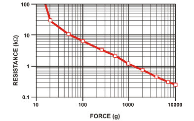
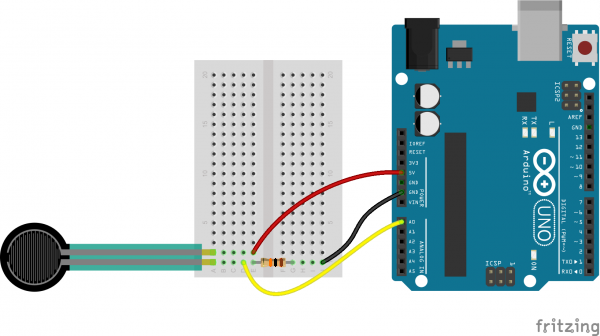

# FSR

The FSR is a force sensitive resistor ([datasheet](https://d2drzakx2pq6fl.cloudfront.net/production/products/resources/55/Datasheet_FSR.pdf)), which means that it will change its resistance in relation to an applied force. The relation between force and resistance is shown in the graph below:



# Hardware setup
Since the Arduino cannot directly measure resistance, we construct a voltage divider ([wikipedia](https://en.wikipedia.org/wiki/Voltage_divider)) which effectively turns a change in resistance into a change in voltage, which can then be measured by the Arduino using the analogRead() function. The hardware is set up as follows:


# Code

```c++

const int FSRpin = A0;  // Analog input pin that the FSR is attached to

int sensorValue = 0;        // value read from the FSR

void setup() {
  // initialize serial communications at 9600 bps:
  Serial.begin(9600);
}

void loop() {
  // read the analog in value:
  sensorValue = analogRead(FSRpin);
  // map it to the range of the analog out:
  // print the results to the serial monitor:
  Serial.println(sensorValue);

  // wait 2 milliseconds before the next loop
  // for the analog-to-digital converter to settle
  // after the last reading:
  delay(2);
}
```

# Now What?
Build the curcuit, upload the code, open the serial monitor in the arduino IDE.
Try opening the **serial plotter** instead.
What happens if you change the delay?