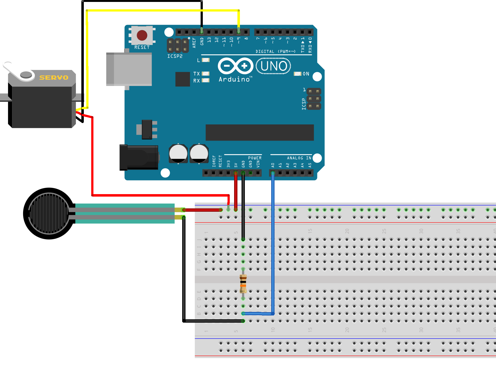

# Controlling the servo with the FSR.

AND NOW.. the moment of truth. You've completed the [servo tutorial](../3_servo) and the [FSR tutorial](../2_FSR), and now it's time to make the FSR control the servo.

# Hardware
Hook up the FSR and the Servo to the same Arduino as shown here:


# Code
Try and mash the code from the two previous tutorials together. Discuss what parts you need and what you don't need. Make sure to avoid duplicates.

Use [the map() function](https://www.arduino.cc/reference/en/language/functions/math/map/) to map the analogRead() range (0-1024) to the servo's input range (0-180)

The procedure could be similar to this:

```c++

//initialize your global variables, like; input value and output value

void setup(){
	//initialize the servo
	}

void loop(){
	//1. read the fsr  
	//2. map the value from the input range to the output range (0-1024 -> 0-180)
	//3. write the mapped value to the servo. 

	}

```

Good luck. Have fun.
If you're looking for extra challenges head on over to [the extras section](../extras)