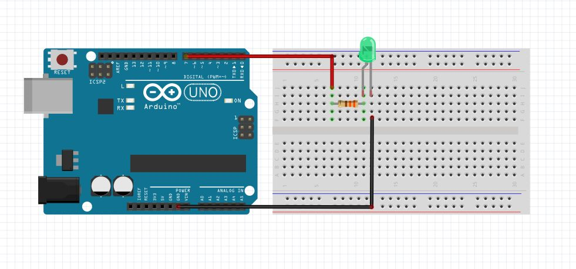

# AUHack Arduino workshop
This workshop will introduce you to basic Arduino. We will connect an LED (indicator), Force sensor (analog sensor), and a servo (analog actuator). We will of course also show you how to program the Arduino to work with these sensors and how they can work together. 

The workshop is a hands-on walkthrough of some of the examples from the arduino website, and some examples that we have rolled ourselves.

**You will be working in pairs.**

# Table of contents
* [Requirements and installation](https://github.com/AUHack/ws18_arduino/#requirements)
* [The tutorials that we will be doing](https://github.com/AUHack/ws18_arduino/#hacks)
* [Extras](https://github.com/AUHack/ws18_arduino/#extras)

# Requirements
Bring a laptop. 

# Installation
go to [arduino.cc](https://www.arduino.cc/en/Main/Software) and download the installer for your preferred operating system. Run it. Done.

# Hacks
* [1 - Blinking an LED](https://www.arduino.cc/en/Tutorial/Blink)
Hardware setup:

* [2 - Reading a force sensitive resistor](./2_FSR)

* [3 - Controlling a servo.](https://www.arduino.cc/en/Tutorial/Sweep)
* [4 - Force controlled servo.](./4_FSR_Controlled_Servo)

# Extras
[Keyboard emulation, IoT, borrowing stuff](./extras)